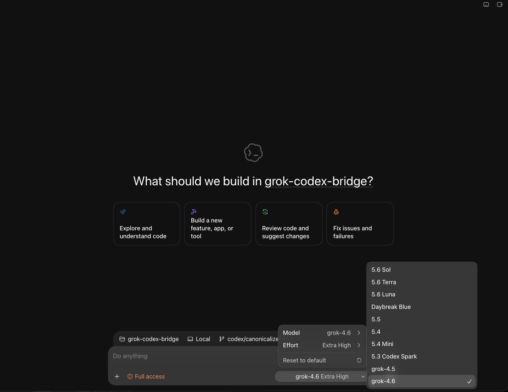

# grok-codex-bridge

[English](README.md)

**Native GPTを置き換えず、Codexハーネスの中でGrokを動かすための、Rust製ネイティブResponses-to-Responsesブリッジです。**

`grok-codex-bridge` はApple Silicon搭載macOS向けの、スタンドアロンかつループバック専用のプロバイダーブリッジです。エージェントループ、ツール、権限、MCPサーバー、Skills、セッション状態は引き続きCodexが担当します。本プロジェクトが担当するのは、ローカルのプロバイダー境界、Responses transportの許容的なprovider projection、Codexが消費するSSE抽出、bridge側のGrok credential境界、xAIへの上流接続です。credential復旧は公式Grok CLIへ委譲します。詳細は [モデルカタログと認証情報](#モデルカタログと認証情報) を参照してください。

Codexプラグイン、汎用LLMルーター、エージェントハーネスではありません。

## ワンコマンド環境切り替え

このリポジトリには、coding agentが守る安全境界とライフサイクル契約を [AGENTS.md](AGENTS.md) に収録しています。リポジトリを一度cloneし、rootからrepo所有の移行コマンドを実行します。

```sh
git clone https://github.com/mlabo-org/grok-codex-bridge.git
cd grok-codex-bridge
./scripts/materialize-macos.sh
```

Native GPT/Grok統合モデルピッカーを有効にします。

```sh
./scripts/grok-codex.sh grok
```

保存済みタスクを維持したままNative互換モードへ切り替えます。

```sh
./scripts/grok-codex.sh native
```

`grok` はGrok slugをxAIへ、Native GPT slugをOpenAIへ送ります。Grok modeでは両方のmodel familyをpickerに表示します。Native modeでは新規選択用にNative GPTだけを表示しますが、既存taskを開いて継続するためのGrok provider metadataは保持し、保存済みGrok slugを実行時コピー上だけ現在のNative GPTモデルへ変換します。タスクに保存されたprovider/modelはどちらの方向でも書き換えません。

どちらのコマンドも、ローカルでbuildしたnative LaunchServices launcherからRust coordinatorへ切替を引き渡します。引き渡し後はTerminal.appへ依存しません。coordinatorはpair runtimeを検証し、必要な交換をChatGPT.app終了要求より前に完了します。本体とapp-serverの停止後はrollbackを所有するpicker切替だけを行い、成功時は新しいstateで再起動し、失敗時はpickerをrollbackしてentry時のDesktop起動状態の復元を試みてからfailureを返します。

### ソースリポジトリと導入済みruntime

このリポジトリには、2つのネイティブ構成要素、すなわちRust bridge executableと、それに対応するSwift製 `Grok Codex Switch.app` launcherの公開sourceを収録しています。materialize処理はApple Silicon向けにこのpairを必ず両方buildします。片方だけをinstallしてはいけません。launcherはChatGPT.app終了後も生き残り、Rust switch coordinatorを最後まで実行し、成功した切替後のChatGPT.app再起動をcoordinatorへ任せます。install時には、実行ファイル、対応するlauncher bundle、設定、catalog state、overlay/resource、lifecycle dataを次へコピーします。

```text
~/Library/Application Support/grok-codex-bridge/
├── bin/grok-codex-bridge
├── bin/Grok Codex Switch.app/
│   └── Contents/Resources/grok-codex-bridge-overlay.md
├── config/bridge.toml
├── state/                 # catalogとpicker管理state
└── logs/
```

install後、切替coordinatorが読むのはこの導入済みtreeと、明示的に渡されたCodex/ChatGPTのlive stateだけです。通常の切替中にcompileしたり、Cargoの `target/`、`dist/`、checkout内の `Grok.md`、replacement scriptを探したりしません。したがって導入済みruntimeは、checkoutを移動または削除しても無効になりません。repo所有の `scripts/grok-codex.sh` はbuild/install/updateの入口であり、導入済みbridgeのruntime依存ではありません。

repoの入口は、ローカルでmaterializeしたruntime pairをinstallまたはupdateしてからmodeを切り替えます。

```sh
./scripts/grok-codex.sh grok    # materialize済みpairをinstall/updateしてGrok modeへ切替
./scripts/grok-codex.sh native  # materialize済みpairをinstall/updateしてNative modeへ切替
```

`grok-codex.sh` は自動compileを行いません。どちらかのmaterialize成果物が欠落またはstaleの場合は停止し、先に `./scripts/materialize-macos.sh` を実行するよう案内します。したがってsourceのinstall/updateはcheckoutに依存します。install後の通常の `mode grok` / `mode native` 切替は導入済みruntime treeだけを使い、checkoutには依存しません。

install後の通常切り替えはrepo非依存で、導入済みnative executableを直接実行します。

```sh
BRIDGE="$HOME/Library/Application Support/grok-codex-bridge/bin/grok-codex-bridge"
"$BRIDGE" mode grok
"$BRIDGE" mode native
```

コマンドは、切替完了まで通常およそ15〜20秒かかることを表示します。この時間は、runtime準備、ChatGPT.app/app-serverの正常終了、picker公開、再起動に使われます。この間はChatGPT.appを強制終了しないでください。切替成功は自動再起動が完了した後に確認されます。picker公開が失敗した場合、coordinatorはrollback後にentry時のDesktop起動状態を復元してからfailureを返します。

2つのnative componentには別々の責務があります。Rust executableはprovider、picker、service、切替stateを所有し、Swift launcherは親のChatGPT.app終了後も残り、LaunchServices経由でcoordinatorを起動します。どちらもinterpreterでもbuild-on-first-use wrapperでもありません。

## 謝辞

本プロジェクトは、[duolahypercho/codex-router](https://github.com/duolahypercho/codex-router/tree/9995c77278608640759982c98ec5bdaeb371c174) から多くの重要な知見を得ています。その実装とドキュメントは実現可能性を確認するうえで大切な先行事例であり、公式Grok認証情報の鮮度、プロバイダー境界に閉じるメタデータ、許容的なResponses/SSE transport投影、ネイティブモデルピッカー統合、可逆な有効化方式の設計判断に大きく役立ちました。MIT Licenseでこの成果を公開された作者とコントリビューターの皆様に、心より敬意と感謝を表します。

本リポジトリには `codex-router` のソースコードをコピーしていません。`grok-codex-bridge` は、LiteLLM/Chatの多段変換ではなく直接的なResponses-to-Responses転送を行う、独立したRust実装です。

## Rustを採用した理由

通常運用を、Python、Node.js、JITランタイムに依存しないローカルbuild済みRust executableとnative Swift launcherにするため、ブリッジ中核をRustで実装しています。Rustの強い型、明示的なエラー処理、メモリ安全な並行処理、決定的なリリース生成も、プロトコル境界とライフサイクル境界に適しています。

通常利用時にオンデマンドコンパイルは行いません。Cargoは開発と構築にだけ使用し、ランチャーは生成済みバイナリを直接実行します。バイナリが存在しない、またはソースより古い場合は安全側に停止します。

## アーキテクチャ

```text
Codexハーネス
  エージェントループ · ツール · 権限 · MCP · Skills · サブエージェント · セッション
        |
        | capabilityで保護されたResponsesリクエスト
        v
grok-codex-bridge（Rust製ネイティブ実行ファイル）
  ローカル認証 · provider projection · Codex向けSSE抽出
        |
        | 接続先を固定したResponses転送
        v
Grok / xAI
```

ブリッジ自身はツールを実行しません。validな関数定義、順序付きツール呼び出しと結果、テキスト、画像URLとdata URI、reasoning summary、必要なResponses制御値を保持し、実行責任はCodexに残します。xAIがrequest全体を拒否するfunction schemaはGrokへの投影からのみ省略し、Codex側のcatalog、tool_search履歴、Native GPT経路は元のtoolを保持します。function / tool_search argument 内の integer-valued JSON number（例: `8.0`）は JSON integer へ直し、実際の小数は変更しません。Grokへ転送するのは replayable な message / function / tool-search 履歴であり、完了済み Native `custom_tool_call` と foreign reasoning は除外します。Codexが完了済みparallel tool batchの途中へassistant commentaryを記録した場合、xAI向け投影ではcommentary本文、call順、result順、すべての`call_id`を保持したままcommentaryをbatch直前へ移動し、Codexの保存履歴自体は書き換えません。GPT/Grok切替時はproviderで再生できない`web_search_call`の実行履歴、item ID、reasoning stateを除外し、tool call/outputを結ぶ`call_id`を保持します。Grokの接続確立または初期body streamのtransport failureは最大3回再試行します。NativeのResponsesとcompactでは、接続失敗、timeout、response header前の切断、初期body streamの失敗、およびHTTP 429・502・503・504を対象に、共有する最大3回の枠で再試行します。待機時間は1秒、2秒、4秒です。最初の送信から60秒の共通期限を、送信と成功応答の最初の本文を待つ処理自体にも適用し、期限後の新しい送信を防ぎます。上流のRetry-Afterが残り期限内に収まる場合はその待ち時間を尊重します。出力開始後はrequestを再実行せず、正常に続くNative streamをこの初期応答期限で打ち切りません。Grokが有用なCodex向けeventのあとterminal markerなしで接続を閉じた場合、bridgeは出力itemを捏造せず、Codexが要求する`response.completed`だけを合成します。`response.failed`または`response.incomplete`を既に受け取っている場合は合成しません。

## 現在の状態

| 対象 | 状態 |
| --- | --- |
| Native GPT/Grok統合モデルピッカー | 現行の主要経路。source実装済みで、supportedなmessage/function/tool-search履歴をbridge境界で双方向に保持 |
| Skillsメタデータ予算 | Grokカタログに272,000トークンを設定し、Codex標準の2%計算を使用 |
| Rustネイティブビルドと可逆なユーザーサービス | Apple Silicon macOS向けに実装済み |
| ワンコマンド `grok` / `native` 移行 | 保存済みprovider/modelを維持する双方向runtime切替と、Desktop正常終了・再起動coordinatorを実装 |
| 公開リリースバイナリ | 意図的に配布しない。各利用者が自分の環境でsourceからbuild・materializeする |

統合pickerを唯一の公開運用経路とします。Native GPTは同じpickerに残り、`native` はproviderを削除せずNative互換routingへ切り替えます。

## 主な機能

- `store: false`を使う、Codex ResponsesからxAI Responsesへの許容的なprovider projection。replayableなmessage / function / tool-search履歴は転送し、完了済み Native `custom_tool_call` と foreign reasoning は Grok request から除外します。旧Chat Completions形式への変換は行いません。
- text、reasoning summary、function call、terminal/usageをCodex向けに抽出するSSE処理。unknownな補助eventでstreamを終了させません。downstreamへresponse内容を確定する前に限り、接続確立と初期body streamのtransport failureを最大3回再試行します。function / tool_search argument の integer-valued JSON number は JSON integer へ正規化します。有用なeventのあと`response.completed`なしでGrokが閉じた場合は、そのlifecycle markerだけを合成し、Codexが `stream closed before response.completed` としてターンを落とさないようにします。
- 画像をダウンロード・再エンコードせず、順序付き関数呼び出し/結果とテキスト・画像混在入力を保持。
- 公式Grokセッションcredentialをbridge側では読み取り専用で利用し、boundedな復旧は公式Grok CLIへ委譲します。詳細は [モデルカタログと認証情報](#モデルカタログと認証情報) を参照してください。
- rustlsで公式xAI接続先に固定し、リダイレクトを禁止。認証、レート制限、HTTP状態、stream障害を型付きで処理。
- Native `models_cache.json` の変更と公式Grokモデル一覧を常駐serviceが追跡し、統合picker、実行中route、メタデータだけのlast-known-good状態を自動更新。
- ループバック専用listenerとcapability保護されたroute。不正なcapabilityには `404` を返します。
- install、LaunchAgentサービス、診断、ピッカー有効化、設定の完全復元を可逆に管理。
- request path、capability、認証情報、response bodyを残さないメタデータ限定ログ。
- Grok選択セッションからも公式Codexサブエージェントを使える。spawn時に `model` / `reasoning_effort` を省略すると、親のGrokではなくCodexの `[agents]` デフォルトが使われる。

## 必要環境

- Apple Silicon搭載macOS。
- ソースからビルドする場合は [rust-toolchain.toml](rust-toolchain.toml) で固定されたRust 1.95.0。
- sourceからのローカルbuildが必須です。コンパイル済みbinaryはrepositoryにもGitHub Releasesにも配布しません。利用者自身のmacOS arm64環境でRust bridgeとSwift launcherを一度compileしてinstallし、その後は導入済み成果物を使います。
- 公式Grok CLIと、有効なloginまたは公式browser OAuthを完了できる環境。
- 現行のCodex CLI。

Intel Mac、Linux、Windows向けのビルド済み成果物は現在提供していません。

## クイックスタート：統合ピッカー

主要経路では、Native GPTと許可済みGrokモデルを同じCodexモデルピッカーで選べる統合カタログを公開します。Native GPTの `responses` と `responses/compact` は取得済みのCodex公式上流に固定します。`images/generations`、`images/edits`、`alpha/search` はNative専用の透過endpointであり、Grok protocol変換には入れません。Grok通信だけをブリッジ経由でxAIへ送ります。Grok modeではxAIの権威ある `responses/compact` 契約がないため、許可済みGrokモデルの圧縮要求を拒否します。Native互換モードでは、保存済みGrokモデル名を `responses` と `responses/compact` の両方でNative fallbackへ変換し、保存済みタスク自体は変更しません。

NativeとGrokのmodel slugは一意でなければなりません。catalog生成時とruntime routing時のどちらでも重複slugはfail closedし、Native行の上書きやalias生成は行いません。

対応するnative pairを一度buildしてから移行します。

```sh
./scripts/materialize-macos.sh
./scripts/grok-codex.sh grok
```

このコマンドはChatGPT認証されたChatGPT.app同梱Codexだけを受け入れ、実効Codex homeの現在の `models_cache.json` を解決します。いずれかのauthoritative inputが得られない場合は、pickerを書き換える前に停止します。

有効化後は常駐bridgeが起動時と1時間ごとに `models_cache.json` のmetadataだけを確認し、変更時だけ内容を検証して、Native modelの追加を統合pickerと実行中routeへ自動反映します。requestごとのcatalog検査は行いません。公式Grok catalogもservice起動時と1時間ごとに取得し、将来の `grok-` modelを同じ経路で追加します。新モデルのたびに `grok` / `native` を切り替えたり、`catalog refresh` を手動実行したりする必要はありません。同期失敗時はlast-known-goodを保持し、次の1時間周期で再試行します。catalog更新だけを理由にChatGPT.appを強制終了しません。

有効化後は新しいCodex CLIプロセスを起動します。Codex Desktopで試す場合は、完全終了してから再起動してください。



統合picker有効化後のCodex Desktopです。Native GPTと許可済みGrokモデルが同じpickerに並びます。

許可済みGrokカタログエントリ（bootstrapの `grok-4.5` / `grok-4.6` を含む）は272,000トークンのコンテキストウィンドウを公開します。これによりCodexは、不明なwindow向けの小さなfallbackではなく、Nativeモデルと同じ標準2%のSkills説明予算計算を適用します。

### Grok.md overlay

[`Grok.md`](Grok.md) は Grok 専用実行 overlay の正本です。`picker install` がこのファイルをディスクから読み、生成カタログの許可済み Grok 行の `base_instructions` へそのまま入れます。Codex が消費するのは生成カタログです。Native GPT 行には届きません。Rust binaryは `Grok.md` をembedせず、materialize時に内容をlauncherの別名resource snapshotとしてコピーします。HTTP 毎に再読込もしません。

`Grok.md`というfilenameは、稼働中Grokへ渡すこの憲法正本だけに予約します。materialize時は内容だけを、意図的に別名とした導入済みsnapshot `Contents/Resources/grok-codex-bridge-overlay.md`へコピーし、他のresourceには`Grok.md`という名前を使いません。

`--grok-overlay` を省略できるのは、カレントディレクトリに `Grok.md` があるときだけです。overlay を直したあとは `picker install` を再実行し、新しい Codex CLI プロセスを起動するか Desktop を完全再起動してください。既存の Grok セッションは、起動時のカタログのままです。

この overlay は第二の憲法ではなく、仕事の伴走契約です。宣言した操作を同じターンでやり切り、必要なツールを呼んだあと、ツール呼び出しや進捗報告だけで終わらずユーザー向け本文まで出させます。統合ピッカーでカタログを書き直して再起動したセッションでは、Grok が実際に読むのがこの経路です。

### 公式サブエージェント

サブエージェントの起動とライフサイクルはCodexが所有します。bridgeはprovider protocolを変換するだけで、workerの起動、toolの公開範囲、modelや推論深度の既定値を所有しません。

- 現在のCodex schemaが公開している公式サブエージェントtool（例: `spawn_agent` / `wait_agent` / `interrupt_agent`）を、そのschemaに従って使います。tool名や公開状況はclientやversionで変わり得るため、このbridgeは特定のtool集合を保証しません。
- `model` または `reasoning_effort` を省略した場合は、現在の公式schemaとcontext propagationの規則に従います。このREADMEは、設定済みdefault、親modelの継承、その他の固定動作を約束しません。
- 現在の `spawn_agent` schemaがoverrideを許し、子をGrokで動かす必要がある場合は、`grok-4.6` や `grok-4.5` など許可済みカタログIDを明示します。その区別が必要でschemaが許す場合は `reasoning_effort` も明示してください。schemaが許さない場合、子のmodelや推論深度を推測してはいけません。

## ライフサイクルとrollback

### 既存インストールの更新

Grokを選択したCodexセッションはローカルのループバックserviceに依存します。そのセッション内でserviceを停止またはbinaryを置換するとモデル接続が切れるため、Native GPT taskまたはTerminalから移行してください。

生成と導入済みバイナリの差し替えは、このブリッジを使っていないセッションから実行してください。この手順の想定オペレーターはGrok Buildです。Native GPTモデルのCodexセッションからでも実行できます。

新しい実行ファイルを生成したあとは、repo所有の差し替えスクリプトで導入済みbinaryを置換してください。直接交換またはGrok modeへの移行ではservice停止前に`auth ensure`を実行し、まずsilent refreshを試し、対話的な復旧がなお必要な場合だけ公式OAuth browserを開きます。Native compatibilityを明示したsource移行ではGrok credentialのread、refresh、loginを省略し、pair検証とrollbackは同じ交換経路で維持します。その後に導入済みbinaryを入れ替え、serviceを再起動して`doctor`を実行します。置換または再起動に失敗した場合は、以前のbinaryとservice状態の復元を試みます。

```sh
./scripts/materialize-macos.sh
./scripts/replace-installed-bridge.sh \
  ./dist/aarch64-apple-darwin/grok-codex-bridge \
  "./dist/aarch64-apple-darwin/Grok Codex Switch.app"
```

`service status` が `service loaded` を返したら、新しいCodex CLIプロセスを起動するか、Desktopを完全再起動してクライアントをつなぎ直してください。

同じmigration entry pointが両方向の移行を所有します。

```sh
./scripts/grok-codex.sh grok
./scripts/grok-codex.sh native
```

`native` はuninstallを実行しません。pickerにはNativeモデルだけを選択可能として表示し、保存済みタスクの解決に必要なGrok行は非表示metadataとして保持します。provider定義とloopback resolverを維持し、Grok推論clientを構築せず、Grok slugのrequestだけを現在のroot Nativeモデルへ実行時変換します。元のrequest、保存済みタスク、SQLite、rolloutは変更しません。

### 橋を完全撤去して標準環境へ戻す

過去の橋経由タスクが利用できなくなることを受け入れ、標準のChatGPT OAuth接続へ戻す場合は、`native` 互換モードではなく次の撤去スクリプトを使います。macOS標準のRubyと、導入済みの橋・ChatGPT.appを使用します。再ビルドは不要です。

```sh
/usr/bin/ruby scripts/uninstall-native.rb --check
/usr/bin/ruby scripts/uninstall-native.rb --execute
```

スクリプトは導入済みCLIの所有範囲検査と `uninstall` を使用し、橋のruntime、専用profile、LaunchAgent、管理対象のpicker設定を撤去・復元します。撤去後、橋の待受がないこと、既定接続先が組み込みOpenAIであること、橋のprovider・catalog・URL設定がないことを確認し、公式App Serverの一時タスクでChatGPT OAuthによる短い実推論を1回行います。推論はアカウントのCodex利用枠を使います。ソース、認証情報、会話本文、履歴DBは変更・削除しません。旧接続先の別名やモデル互換設定も残しません。

Codex内から撤去する場合、実行中の会話が橋への接続を失うため、次の操作でTerminalへ処理を引き渡します。導入済み `codex-remote-restart` が必要です。

```sh
/usr/bin/ruby scripts/uninstall-native.rb --handoff
```

`--handoff` は引渡しメッセージを表示するため15秒待ってから、撤去・検証・再起動を別プロセスで実行します。結果は `~/Library/Logs/grok-codex-uninstall.log` に出力します。再起動の引渡しと画面の復帰は別の状態です。通常のTerminalから `--execute` を使った場合は、完了後にCodexを完全終了して開き直してください。`--execute --restart` でも導入済み再起動ツールへ引き渡せます。

保存済みprovider/model参照は変換しません。過去の橋経由タスクが必要な場合は、この撤去を実行せず、互換モードを使用してください。

可逆なNative-only運用には `native` を使います。これは意図的にuninstallではありません。導入済みprovider定義、resolver、互換metadataを残すため、後から `grok` へ戻してもtask履歴を書き換えずにGrok routingを復元できます。完全撤去は、旧タスクが利用できなくなることを受け入れる場合、または別途明示されたdata migrationが完了した場合に限ります。

source更新はmode切替とは別のlifecycle境界です。新しいnative componentのbuild/materializeとinstallは、Native GPT taskまたはTerminalから実行し、導入済みreplacement経路にserviceの停止・再起動を任せます。通常のmode切替でbinaryを再buildすることはありません。更新後はCodex Desktopを一度再起動し、新しいpicker catalogを読み込ませてください。

## モデルカタログと認証情報

ブリッジは、権威あるcredential fileを次の順序で解決します。

1. `GROK_AUTH_PATH` が設定されている場合はそのfile。
2. `GROK_HOME` が設定されている場合は `GROK_HOME/auth.json`。
3. それ以外は `~/.grok/auth.json`。

選択したfileはsymlinkを追跡せず、読み取り専用で開きます。`GROK_AUTH_PATH`はcredential fileを選び、`GROK_HOME`は更新トリガーに使う公式CLIのhomeを選びます。`GROK_AUTH_PATH`が公式Grok homeの外を指す場合は、対応する公式CLIを解決できるよう `GROK_HOME` も設定してください。`GROK_HOME`が未設定で `HOME` が利用できる場合、helperは `~/.grok/bin/grok` です。

公式session recordに `expires_at` があればその時刻を使います。無い場合はparserのfallbackとして `create_time + 30日` を使います。これは公式Grok sessionの有効期間を保証する値ではありません。`auth status` はcredentialの有無だけを表示し、credentialや有効期限は表示しません。

Responses provider requestでmissing、incomplete、expiredの再認証可能なcredential状態を検出した場合、bridgeは公式 `bin/grok models` をstdin/stdout/stderr切断、7秒timeoutで一度だけ起動し、その後最大60秒、権威fileの再読込を待ちます。この非対話経路はbrowserを開きません。公式processが更新できなければ、そのrequestは認証errorになります。

明示的なlifecycle操作では、`auth ensure`が最初に同じread-only検査とsilent refreshを行います。有効または非対話更新済みなら即時終了し、それでもmissing、incomplete、expiredの場合だけ、公式desktop OAuthをprocess出力なしで一度起動し、最大5分だけbrowser完了を待って権威fileをread-only再検査します。browserとcredential更新は公式CLIが所有し、malformed、ambiguous、unsafeなfileではloginを起動せずfail closedします。

```sh
./dist/aarch64-apple-darwin/grok-codex-bridge auth ensure
```

browser確認は、公式CLIが開いた`auth.x.ai`の公式ページだけで完了してください。認証情報をchat、log、repositoryへ貼らないでください。導入済みbinary交換scriptはservice停止前に`auth ensure`を実行するため、期限切れloginが再起動後doctorのrollbackを起こしません。完了後、credentialを表示せずにbridgeを確認します。

```sh
./dist/aarch64-apple-darwin/grok-codex-bridge auth status
./dist/aarch64-apple-darwin/grok-codex-bridge service status
```

`catalog refresh` はすべての自動credential復旧とは別物です。現在利用できるcredentialが必要で、silent-refresh helperも対話loginも起動せず、last-known-goodのmodel catalogだけを更新します。checked-in configは絶対pathがplaceholderのtemplateなので、そのまま実行できません。未追跡のlocal configへコピーし、placeholderを実際の絶対pathへ置き換えてから実行します。

```sh
cp ./docs/bridge-config.example.toml ./bridge-config.local.toml
# ./bridge-config.local.toml のmachine-localな絶対pathを編集する。
./dist/aarch64-apple-darwin/grok-codex-bridge catalog refresh \
  --config ./bridge-config.local.toml
```

`refresh_on_start = true` はservice起動時のGrok catalog取得に加え、常駐中の1時間ごとの自動取得も有効にします。明示的な `catalog refresh` commandは診断用に一度だけcatalog requestを実行しますが、通常運用では不要です。local configは未追跡のまま保持し、認証情報やruntime固有pathをcommitしないでください。

## セキュリティ境界

- listenerはloopbackだけにbindします。LAN公開は製品scope外です。
- caller capabilityはローカルrouteに置き、service logには記録しません。
- 認証情報は公式の権威あるファイルとゼロ化対応メモリキャッシュにだけ保持し、catalogやCodex stateへコピーしません。
- Grok通信は公式xAI originに限定し、rustlsを使用してredirectを追跡しません。
- catalog writeと管理対象設定の変更はatomicかつ可逆です。
- 認証情報、token、`.env`、秘密鍵、runtime state、session log、生成catalog、マシン固有パスをGit履歴へ入れてはいけません。
- crateは crates.ioへの誤公開を防ぐため `publish = false` を宣言しています。

## 開発

今回のmaterialize処理は、CargoとSwiftの中間出力を専用の一時ディレクトリへ置き、終了時に削除します。既存の `target/` や環境変数 `CARGO_TARGET_DIR` に依存せず、検証済みの本体とランチャーを `dist/` へ配置します。

Grokモデル一覧の取得後は、その場でピッカーと実行経路を同期します。要求の振り分けではNativeとGrokの一覧を同じ公開状態から読み、同期に失敗した場合は以前の実行経路を維持します。設定復元時には、Desktop側で管理設定が書き直されていても、管理外のコメントや書式を保持します。

同じサービスへの同時要求で認証が期限切れになった場合は、進行中の認証更新を共有し、公式helperの重複起動を避けます。Nativeへの退避更新の最終診断は `doctor --native-compatibility` を使い、Grok認証情報のパス解決・読込を行いません。通常の `doctor` は従来どおりGrok認証も検査します。

ソースtestを実行します。

```sh
cargo test --locked
```

開発専用でソースから実行する場合：

```sh
cargo run -- --version
```

`cargo run` は通常runtime routeではありません。release binaryを生成し、直接実行してください。

```sh
./scripts/materialize-macos.sh
./dist/aarch64-apple-darwin/grok-codex-bridge status
```

製品scopeと受け入れcontractは [docs/spec.md](docs/spec.md)、配布要件は [docs/distribution-contract.md](docs/distribution-contract.md) で定義しています。

## ソース構成

```text
src/lib.rs                           crate root
src/cli.rs                           CLI境界
src/config.rs                        version付きruntime設定
src/credential.rs                    読み取り専用Grok認証境界
src/catalog.rs                       atomicなmetadata-onlyモデルカタログ
src/native.rs                        取得済みfirst-party Native GPT上流route
src/grok.rs                          xAI接続先を固定したtransport
src/protocol.rs                      Responses provider projectionとSSE抽出
src/server.rs                        capability保護されたloopback service
src/lifecycle.rs                     可逆なinstallとrollbackの所有者
src/picker.rs                        Native GPT/Grok統合catalog生成
Grok.md                              picker catalog生成時に読むGrok overlay SSOT
src/picker_activation.rs             pickerのatomicな公開と有効化
src/launchd.rs                       型付きuser LaunchAgent境界
scripts/materialize-macos.sh         決定的macOS arm64 materialization
scripts/macos-switch-launcher/       Swift LaunchServices launcher source
scripts/grok-codex.sh                Grok/native環境のワンコマンド移行
scripts/replace-installed-bridge.sh  導入済みnative runtimeの差し替え
```

## ライセンス

[MIT License](LICENSE) で公開します。
